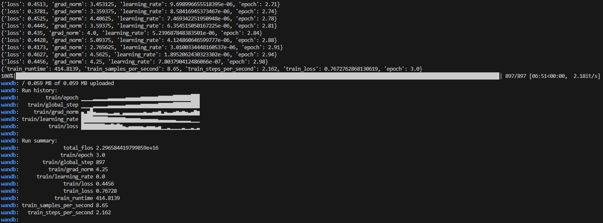
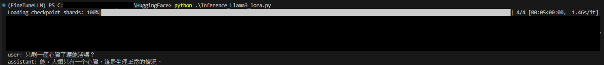

# HuggingFace-FineTune

## Installation
```bash
git clone https://github.com/HoningLo/HuggingFace-FineTune.git
cd HuggingFace-FineTune
```

Create a virtual environment:

- Python >= 3.11
- CUDA = 12.1

``` bash
conda create HuggingFace-FineTune python=3.11
conda activate HuggingFace-FineTune
```

Install the dependencies:
``` bash
pip install --upgrade pip
pip install -r requirements.txt
```

## Usage
### Training

```bash
python Fine-Tune_Llama3_lora.py
```

Output:


### Inference

```bash
python Inference_Llama3_lora.py
```

Output:
